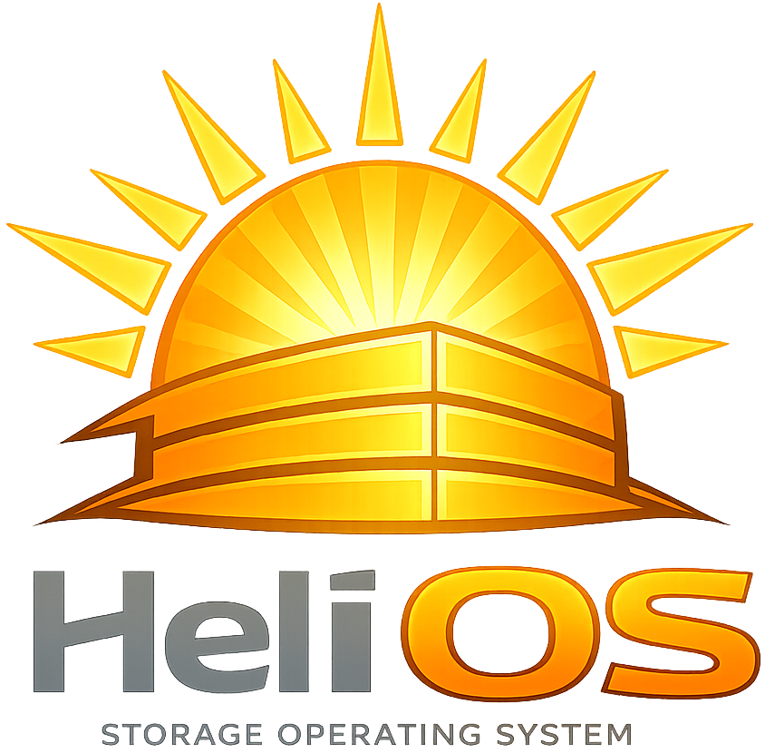

  

  

  A Lightweight Operating System Built for Object Storage

### Premise
This project is intended to be a hobby project where I learn how to make an operating system from scratch while adding my own twist to it. The scope of the project will start extremely small, and I intend to expand it in phases. The current end goal for this project is to have an Operating System that can run a distributed object store across multiple Raspberry Pi Nodes. This is a large undertaking so I will be attempting to achieve this in multiple phases with the intention that some plans may never actually come to fruition. You can view the [Roadmap](docs/development/roadmap/index.md) to see where we are, future plans, and just the general direction I want this project to go.

### Table of Contents
- [Documentation](docs/index.md)

---
***Important Note:** This Operating System is a hobby project and a learning experience, thus it isn't expected or intended to be in any way functional for a while.*
