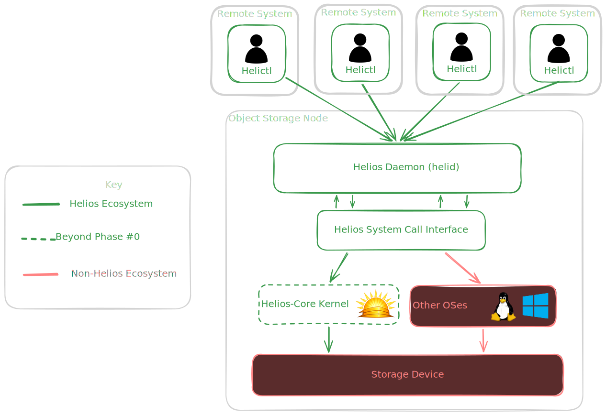

  

  
  
  

  A Lightweight Operating System Built for Object Storage

<h2 align="center">Premise</h2>
Helios is a hobby project aimed at building an Operating System and its core components from scratch, documented step-by-step in my [blog](https://matthewthe.dev/helios). The goal is to take a structured, phased approach — starting with a fully functional Object Storage daemon running on Linux, and progressively migrating it to run on a custom kernel.

Central to this approach is the Helios System Call Interface ([helios-sci](./crates/helios-sci/README.md)), an abstraction layer that exposes networking, storage, and other OS primitives in a way that's compatible with both Linux and helios-core. This means the daemon itself remains largely untouched as the underlying platform evolvesm, ideally just a feature flag away from switching targets. The final architecture is outlined below.

<h2 align="center">Development</h2>
This project acts as a mono-repo combining the functionalities of all of it's subprojects. This means that `helios` stores all of the required scripts for developing, building, and using the submodules together. Certain submodules (i.e. helictl, helios-http, helid) are capabale of being used on their own and will have associated documentation regarding how to use them on their own as either a binary, or a library.

1. Clone the repository and submodules: `git clone --recurse-submodules git@github.com:mhambrec/helios.git`
2. Copy `.env.example` to `.env` and modify as necessary. The defaults target a 32-bit `i686` kernel build out of the box.
3. Run `just` to view the more standard task running commands (i.e. `just build <crate>`, `just gdb <crate>`).
4. For more finegrained build commands and detailed coding standards and information review the [advanced development documentation](./docs/development/index.md).

<h2 align="center">Components</h2>
- [Helios Kernel (helios-core)](./crates/helios-core/README.md): The kernel of the Helios operating system.
- [Helios System Call Interface (helios-sci)](./crates/helios-sci/README.md): Kernel operation abstraction layer for the Helios ecosystem.
- [Helios Daemon (helid)](./crates/helid/README.md): Filesystem storage control daemon.
- [Helios Control (helictl)](./crates/helictl/README.md): Remote CLI control application for interacting with a `helid` service.
- [Helios HTTP (helios-http)](./crates/helios-http/README.md): Simple HTTP server built on top of the Helios TCP stack.

<h2 align="center">Documentation</h2>

- [Documentation](docs/index.md)

---
***Important Note:** This is an active learning project, expect rough edges and frequent change*
