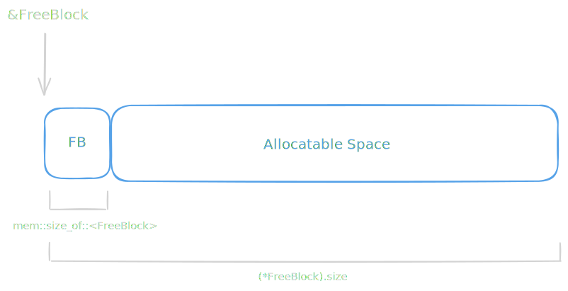
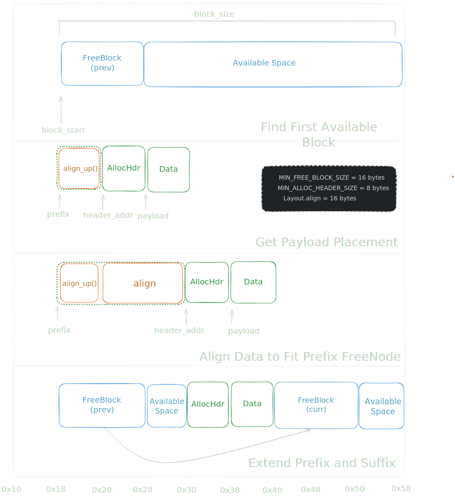
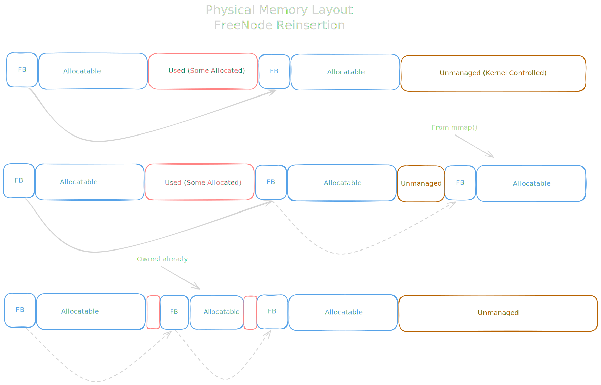

# Heap Management - Free Lists and Allocation

### Initial Empty Heap

Image shows our heap on initialization with a single `1 MiB` `mmap()` region.

See [here](../../notes/phase_0/custom-allocator.md#initialization) for a detailed walkthrough of the initialization process, including how we set up the initial heap region and free list.

### Insertions and Splitting

See [here](../../notes/phase_0/custom-allocator.md#allocation-first-fit-with-splitting) for a detailed walkthrough of the insertion process, including how we handle alignment and splitting of free blocks.

### Freeing Space and Extending the Heap

* First shows a valid state for a Physical Memory layout of our heap
* Second shows deallocation of a block of memory, and subsequent reinsertion of the resulting free block into the free list.
* The third shows a new block of memory being added to the heap via `mmap` and then inserted into the free list.

See [here](../../notes/phase_0/custom-allocator.md#inserting-free-blocks-and-coalescing) for a detailed walkthrough of the deallocation and reinsertion process, including how we handle coalescing of adjacent free blocks.

***Note** The diagram doesn't illustrates fragmentation in the third image. If the allocated data between was removed from either side we would see fragmentation, and coalescing would occur to prevent it.*

